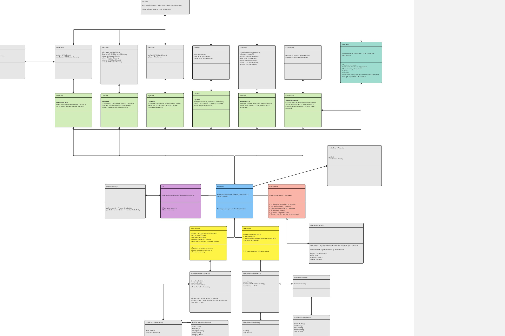

# Проектная работа "Веб-ларек"

Стек: HTML, SCSS, TS, Webpack

Структура проекта:

- src/ — исходные файлы проекта
- src/components/ — папка с JS компонентами
- src/components/base/ — папка с базовым кодом
- src/components/model/ — папка с моделями данных
- src/components/view/ — папка с кодом, отвечающими за пользовательский интерфейс
- src/components/presenter/ — папка с кодом, отвечающим за связь между моделями данных и пользовательским интерфейсом

Важные файлы:

- src/pages/index.html — HTML-файл главной страницы
- src/types/index.ts — файл с типами
- src/index.ts — точка входа приложения
- src/styles/styles.scss — корневой файл стилей
- src/utils/constants.ts — файл с константами
- src/utils/utils.ts — файл с утилитами

## Установка и запуск

Для установки и запуска проекта необходимо выполнить команды

```
npm install
npm run start
```

или

```
yarn
yarn start
```

## Сборка

```
npm run build
```

или

```
yarn build
```

## Архитектура

Архитектурный паттерн: MVP (Model View Presenter)

- `Model`: Слой для работы с данными.
- `View`: Слой для отображения данных и работы с пользовательским интерфейсом.
- `Presenter`: Промежуточный слой между View и Model. Запрашивает данные, их редактирование, реагирует на изменения. Отправляет View актуальные инструкции для отображения.

### UML-схема архитектуры проекта

Читать UML-схему в формате .jpg может быть затруднительно, ниже можно найти ссылку на удобный просмотр в Miro.

[Cсылка UML-схему в JPG](./arch.jpg)


[Cсылка на Miro – UML-схема архитектуры проекта в хорошем качестве](https://miro.com/app/board/uXjVKNupwEA=/?share_link_id=121664003564)

## Структура базового кода

### Класс Api

Позволяет обмениваться данными с сервером. Позволяет получить продукты и отправить заказ. Имплементирует интерфейс `IApi`:

```ts
export interface IApi {
	getProducts: () => Promise<IProductList>;
	postOrder: (order: IOrder) => Promise<IOrderEntity>;
}
```

### Класс Component

Содержит инструментарий для работы с DOM в дочерних компонентах.

#### Позволяет:

- Переключить класс
- Установить текстовое содержимое
- Сменить статус блокировки
- Скрыть
- Показать
- Установить изображение с алтернативным текстом
- Вернуть корневой DOM-элемент

Имплементирует интерфейс `IComponent`:

```ts
export interface IComponent<T> {
	toggleClass: (
		element: HTMLElement,
		className: string,
		force?: boolean
	) => void;

	setDisabled: (element: HTMLElement, state: boolean) => void;
	render: (data?: Partial<T>) => HTMLElement;
}
```

### Класс Model

Абстрактный класс базовой модели, чтобы можно было отличить ее от простых объектов с данными. Имплементирует интерфейс `IModel`:

```ts
export interface IModel {
	emitChanges: (event: string, payload?: object) => void;
}
```

### Класс EventEmitter

#### Помогает работать с событиями:

- Установить обработчик на событие
- Снять обработчик с события
- Инициировать событие с данными
- Слушать все события
- Сбросить все обработчики
- Сделать коллбек триггер, генерирующий событие при вызове

Имплементирует интерфейс `IEvents`:

```ts
export interface IEvents {
	on<T extends object>(event: EventName, callback: (data: T) => void): void;
	emit<T extends object>(event: string, data?: T): void;
	trigger<T extends object>(
		event: string,
		context?: Partial<T>
	): (data: T) => void;
}
```

### Класс Presenter

Реализует единую точку входя для работы со слоем Presenter. Имплементирует интерфейс `IPresenter`:

```ts
export interface IPresenter {
	api: IApi;
	eventEmitter: IEvents;
}
```

## Слой – Model

Слой для работы с данными. Содержит две сущности:

- #### Продукт

```ts
// Сущность – Продукт
export interface IProductEntity {
	id: ProductID;
	title: string;
	description: string;
	image: string;
	category: string;
	price: number;
}
```

- #### Заказ

```ts
// Сущность – Заказ
export interface IOrderEntity {
	id: string; // Выдается сервером
	total: number; // Сумма заказа
}
```

### Модель сущности Продукт

Содержит данные о продуктах и их состояниях:

- Доступно к покупке
- Продукты в корзине
- Сумма продуктов в корзине
- Выбранный продукт в данный момент

Позволяет:

- Хранить заявленные данные
- Проверить продукт в корзине
- Удалить продукт из корзины
- Очистить корзину

Имплементирует интерфейс `IProductModel`:

```ts
export interface IProductModel {
	items: IProductList; // Доступно к покупке
	cart: IProductList; // Продукты в корзине
	cartAmount: number; // Сумма продуктов в корзине
	selectedItem: IProductEntity; // Выбранный продукт в данный момент

	isInCart: (item: IProductEntity) => boolean; // Проверить продукт в корзине
	removeFromCart: (item: IProductEntity) => IProductList; // Удалить продукт из корзины
	clearCart: () => void; // Очистить корзину
}
```

### Модель сущности Заказ

Содержит данные о текущем заказе:

- Текущий заказ
- Оформленные заказы (возможно, в будущем понадобится хранить)

Позволяет:

- Сохранить данные текущего заказа
- Отчистить данные текущего заказа

Имплементирует интерфейс `IOrderModel`:

```ts
export interface IOrderModel {
	state: IOrder; // Текущий заказ
	completedOrders: IOrderEntity[]; // Оформленные заказы (возможно, в будущем понадобится хранить)
	resetState: () => IOrder; // Отчистить данные текущего заказа
}
```

## Слой – View

Слой для отображения данных и работы с пользовательским интерфейсом.

- Модальное окно `ModalView`: Может отображать динамичный контент и обязательно содержит кнопку "Закрыть".

```ts
// Базовый View
// Используется для компонентов с динамичным контентом
export interface IContentView {
	content: HTMLElement;
}

// Модальное окно
// Может отображать динамичный контент и обязательно содержит кнопку "Закрыть"
export interface IModalView extends IComponent<IContentView> {
	content: HTMLElement;
	closeButton: HTMLButtonElement;
}
```

- Карточка `CardView`: Используется в различных списках и галереях. Содержит обязательные и опциональные элементы в зависимости от контекста.

```ts
// Карточка
// Используется в различных списках и галереях
// Содержит обязательные и опциональные элементы в зависимости от контекста
export interface ICardView extends IComponent<IProductEntity> {
	title: HTMLHeadingElement;
	description?: HTMLParagraphElement;
	image: HTMLImageElement;
	price: HTMLSpanElement;
	category: HTMLSpanElement;
	button?: HTMLButtonElement;
}
```

- Страница `PageView`: Отображает количество добавленных в корзину продуктов. Отображает галерею доступных к продаже продуктов.

```ts
// Страница
// Отображает количество добавленных в корзину продуктов
// Отображает галерею доступных к продаже продуктов
export interface IPageView extends IComponent<IProductList> {
	cartTotal: HTMLSpanElement;
	gallery: HTMLElement;
}
```

- Корзина `CartView`: Отображает список добавленных в корзину продуктов, их общую стоимость. Содержит кнопку оформления заказа.

```ts
// Корзина
// Отображает список добавленных в корзину продуктов
// Отображает стоимость добавленных в корзину продуктов
// Содержит кнопку оформления заказа
export interface ICartView extends IComponent<IProductList> {
	list: HTMLElement;
	price: HTMLSpanElement;
	button: HTMLButtonElement;
}
```

- Форма заказа `FormView`: Содержит обязательные поля для оформления заказа, предполагает отображение ошибок валидации.

```ts
// Форма заказа
// Содержит обязательные поля для оформления заказа
// Предполагает отображение ошибок валидации
export interface IFormView extends IComponent<IOrderForm> {
	paymentMethodToggleButtons: HTMLButtonElement[];
	address: HTMLInputElement;
	email: HTMLInputElement;
	phone: HTMLInputElement;
	submit: HTMLButtonElement;
	errors: HTMLSpanElement;
}
```

- Заказ оформлен `SuccessView`: Отображает описание с финальной суммой заказа, содержит кнопку, которая закроет модальное окно и обнулит текущий заказ с корзиной.

```ts
// Заказ оформлен
// Отображает описание с финальной суммой заказа
// Содержит кнопку, которая закроет модальное окно и обнулит текущий заказ с корзиной
export interface ISuccessView extends IComponent<IOrderEntity> {
	description: HTMLParagraphElement;
	closeButton: HTMLButtonElement;
}
```

## Слой – Presenter

Класс `Presenter`: реализует единую точку входа для работы с API и EventEmitter. Имплементирует интерфейс `IPresenter`.

```ts
export interface IPresenter {
	api: IApi;
	eventEmitter: IEvents;
}
```
