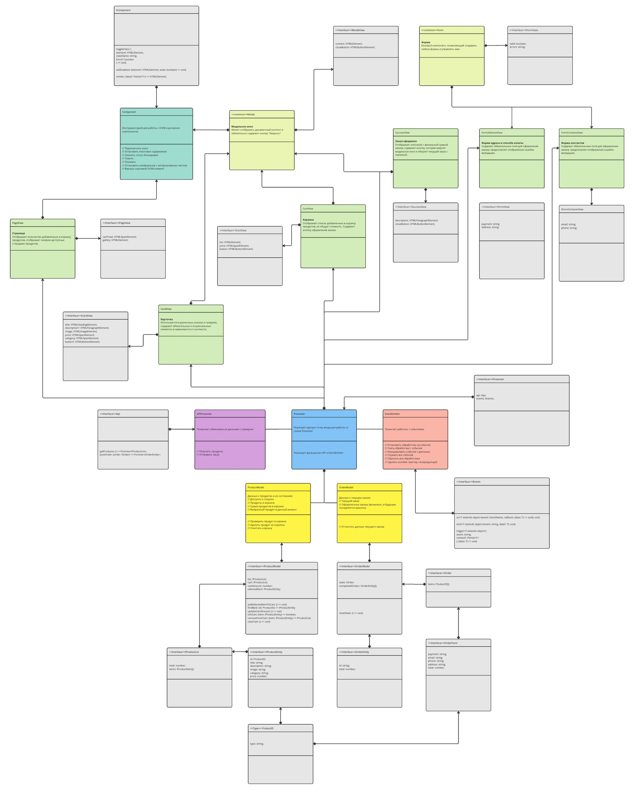

# Проектная работа "Веб-ларек"

Стек: HTML, SCSS, TS, Webpack

Структура проекта:

- src/ — исходные файлы проекта
- src/components/ — папка с JS компонентами
- src/components/base/ — папка с базовым кодом
- src/components/model/ — папка с моделями данных
- src/components/common/ — папка с базовым кодом, отвечающими за пользовательский интерфейс
- src/components/view/ — папка с кодом, отвечающими за пользовательский интерфейс
- src/components/presenter/ — папка с кодом, отвечающим за связь между моделями данных и пользовательским интерфейсом

Важные файлы:

- src/pages/index.html — HTML-файл главной страницы
- src/types/index.ts — файл с типами
- src/index.ts — точка входа приложения
- src/styles/styles.scss — корневой файл стилей
- src/utils/constants.ts — файл с константами
- src/utils/utils.ts — файл с утилитами

## Установка и запуск

Для установки и запуска проекта необходимо выполнить команды

```
npm install
npm run start
```

или

```
yarn
yarn start
```

## Сборка

```
npm run build
```

или

```
yarn build
```

## Архитектура

Архитектурный паттерн: MVP (Model View Presenter)

- `Model`: Слой для работы с данными.
- `View`: Слой для отображения данных и работы с пользовательским интерфейсом.
- `Presenter`: Промежуточный слой между View и Model. Запрашивает данные, их редактирование, реагирует на изменения. Отправляет View актуальные инструкции для отображения.

### UML-схема архитектуры проекта

Читать UML-схему в формате .jpg может быть затруднительно, ниже можно найти ссылку на удобный просмотр в Miro.

[Cсылка UML-схему в JPG](./uml_web-larek.jpg)


[Cсылка на Miro – UML-схема архитектуры проекта в хорошем качестве](https://miro.com/app/board/uXjVKNupwEA=/?share_link_id=121664003564)

## Структура базового кода

### Класс Api

Позволяет обмениваться данными с сервером.

### Класс Component

Содержит инструментарий для работы с DOM в дочерних компонентах.

#### Позволяет:

- Переключить класс
- Установить текстовое содержимое
- Сменить статус блокировки
- Скрыть
- Показать
- Установить изображение с алтернативным текстом
- Вернуть корневой DOM-элемент

Имплементирует интерфейс `IComponent`:

```ts
export interface IComponent<T> {
	toggleClass: (
		element: HTMLElement,
		className: string,
		force?: boolean
	) => void;

	setDisabled: (element: HTMLElement, state: boolean) => void;
	render: (data?: Partial<T>) => HTMLElement;
}
```

### Класс Model

Абстрактный класс базовой модели, чтобы можно было отличить ее от простых объектов с данными. Имплементирует интерфейс `IModel`:

```ts
export interface IModel {
	emitChanges: (event: string, payload?: object) => void;
}
```

### Класс EventEmitter

#### Помогает работать с событиями:

- Установить обработчик на событие
- Снять обработчик с события
- Инициировать событие с данными
- Слушать все события
- Сбросить все обработчики
- Сделать коллбек триггер, генерирующий событие при вызове

Имплементирует интерфейс `IEvents`:

```ts
export interface IEvents {
	on<T extends object>(event: EventName, callback: (data: T) => void): void;
	emit<T extends object>(event: string, data?: T): void;
	trigger<T extends object>(
		event: string,
		context?: Partial<T>
	): (data: T) => void;
}
```

## Слой – Model

Слой для работы с данными. Содержит две сущности:

- #### Продукт

```ts
// Сущность – Продукт
export interface IProductEntity {
	id: ProductID;
	title: string;
	description: string;
	image: string;
	category: string;
	price: number;
}
```

- #### Заказ

```ts
// Сущность – Заказ
export interface IOrderEntity {
	id: string; // Выдается сервером
	total: number; // Сумма заказа
}
```

### Модель сущности Продукт

Содержит данные о продуктах и их состояниях:

- Доступно к покупке
- Продукты в корзине
- Сумма продуктов в корзине
- Выбранный продукт в данный момент

Позволяет:

- Хранить заявленные данные
- Проверить продукт в корзине
- Удалить продукт из корзины
- Очистить корзину

Имплементирует интерфейс `IProductModel`:

```ts
export interface IProductModel {
	list: IProductList; // Доступно к покупке
	cart: IProductList; // Продукты в корзине
	cartAmount: number; // Сумма продуктов в корзине
	selectedItem: IProductEntity; // Выбранный продукт в данный момент

	addSelectedItemToCart: () => void; // Добавить выбранный товар в корзину
	findById: (id: ProductID) => IProductEntity; // Найти товар по ID
	isInCart: (item: IProductEntity) => boolean; // Проверить продукт в корзине
	removeFromCart: (item: IProductEntity) => IProductList; // Удалить продукт из корзины
	updateCartAmount: () => void; // Обновить стоимость корзины
	clearCart: () => void; // Очистить корзину
}
```

### Модель сущности Заказ

Содержит данные о текущем заказе:

- Текущий заказ
- Оформленные заказы (возможно, в будущем понадобится хранить)

Позволяет:

- Сохранить данные текущего заказа
- Отчистить данные текущего заказа

Имплементирует интерфейс `IOrderModel`:

```ts
export interface IOrderModel {
	state: IOrder | null; // Текущий заказ
	completedOrders: IOrderEntity[]; // Оформленные заказы (возможно, в будущем понадобится хранить)
	resetState: () => void; // Отчистить данные текущего заказа
}
```

## Слой – View

Слой для отображения данных и работы с пользовательским интерфейсом.

- #### Базовый компонент
  `IComponent<T>`: Помогает создать любой компонент для View.

```ts
// Описание класса для создания компонентов
export interface IComponent<T> {
	toggleClass: (
		element: HTMLElement,
		className: string,
		force?: boolean
	) => void;

	setDisabled: (element: HTMLElement, state: boolean) => void;
	render: (data?: Partial<T>) => HTMLElement;
}
```

- #### Базовое модальное окно

`Modal`: Модальное окно.
Может отображать динамичный контент и обязательно содержит кнопку "Закрыть"
Имплементирует интерфейс `IModalView`:

```ts
export interface IModalView extends IComponent<IContentView> {
	content: HTMLElement;
	closeButton: HTMLButtonElement;
}
```

- #### Базовая форма

`Form`: Универсальный класс для создания формы.
С ним удобно эмитить события и настраивать валидацию. Имплементирует интерфейс состояния формы:

```ts
// Состояние формы
export interface IFormState {
	valid: boolean;
	errors: string;
}
```

- #### Карточка
  `CardView`: Используется в различных списках и галереях. Содержит обязательные и опциональные элементы в зависимости от контекста.

```ts
// Карточка
// Используется в различных списках и галереях
// Содержит обязательные и опциональные элементы в зависимости от контекста
export interface ICardView {
	title: HTMLHeadingElement;
	price: HTMLSpanElement;
	description?: HTMLParagraphElement;
	image?: HTMLImageElement;
	category?: HTMLSpanElement;
	button?: HTMLButtonElement;
}
```

- #### Страница
  `PageView`: Отображает количество добавленных в корзину продуктов. Отображает галерею доступных к продаже продуктов. Имплементирует интерфейс `IPageView`

```ts
// Страница
// Отображает количество добавленных в корзину продуктов
// Отображает галерею доступных к продаже продуктов
export interface IPageView {
	cartTotal: number;
	gallery: HTMLElement[];
}
```

- #### Корзина
  `CartView`: Отображает список добавленных в корзину продуктов, их общую стоимость. Содержит кнопку оформления заказа. Имплементирует интерфейс `ICartView`

```ts
// Корзина
// Отображает список добавленных в корзину продуктов
// Отображает стоимость добавленных в корзину продуктов
export interface ICartView {
	list: HTMLElement[];
	totalPrice: number;
}
```

- #### Форма адреса и способа оплаты
  `FormView`: Содержит обязательные поля для указания метода оплаты и адреса доставки, предполагает отображение ошибок валидации. Имплементирует интерфейс `IFormAddressView`

```ts
// Форма адреса и формы оплаты
export interface IFormAddressView {
	payment: string;
	address: string;
}
```

- #### Форма контактов
  `FormView`: Содержит обязательные поля для указания способов связи, предполагает отображение ошибок валидации. Имплементирует интерфейс `IFormContactsView`

```ts
// Форма контактов
export interface IFormContactsView {
	email: string;
	phone: string;
}
```

- #### Заказ принят
  `SuccessView`: Отображает описание с финальной суммой заказа, содержит кнопку, которая закроет модальное окно и обнулит текущий заказ с корзиной. Имплементирует интерфейс `ISuccessView`:

```ts
// Заказ оформлен
// Отображает описание с финальной суммой заказа
export interface ISuccessView {
	description: number;
}
```

## Слой – Presenter

### Класс APIProducts

Расширяет базовый класс API, добавляя методы:

```ts
// Получить список продуктов
	getProducts(): Promise<IProductList> {
		return this.get('/product').then((data: IProductList) => {
			data.items.forEach((item) => {
				item.image = this.cdn + item.image;
			});
			return data;
		});
	}

	// Опубликовать заказ
	postOrder(order: IOrder): Promise<IOrderEntity> {
		return this.post('/order', order).then((data: IOrderEntity) => data);
	}
```

Имплементирует интерфейс `IAPI`:

```ts
// API
// Для работы с сервером
export interface IAPI {
	getProducts: () => Promise<IProductList>;
	postOrder: (order: IOrder) => Promise<IOrderEntity>;
}
```

### Класс EventEmitter

Используется класс из базового кода. См. полное описание в разделе "Базовый код" выше.

### Класс Presenter

Реализует единую точку входя для работы со слоем Presenter. В данной работе он используется для наглядности. Можно было обойтись инициализацией экземпляров EventsEmitter и Api в файле index.ts, но Presenter позволяет нам явно продемонстрировать паттерн MVP.

Имплементирует интерфейс `IPresenter`:

```ts
export interface IPresenter {
	api: IAPI;
	events: IEvents;
}
```

## Логика работы по MVP

Бизнес-логика приложения реализуется цепочками событий между слоями M(Model) V(View) P(Presenter).
Коротко это можно описать так:

- `View`: Пользователь запрашивает отрисовку данных
- `Presenter`: Запрос отправляется на сервер, ответ отправляется в модель
- `Model`: Полученный результат записывается в модель и докладывается об изменении данных
- `Presenter`: Замеченные изменения отправляются в соответствующий View на отрисовку
- `View`: Отрисовывает новые данные

### Подробное описание логики работы приложения

Разберем каждый процесс в отдельности.

#### Инициализация класса Presenter

Делается исключительно для наглядной демонстрации MVP-паттерна. Можно использовать api и eventsEmitter без объединения в классе Presenter, просто инициализируя соответствующие экземпляры в файле index.ts. Но код с префиксом presenter нагляднее демонстрирует задуманную логику.

```ts
const presenter = new Presenter(
	new APIProducts(CDN_URL, API_URL), // Для работы с API
	new EventEmitter() // Для работы с событиями
);
```

#### Инициализация моделей данных

Слой Model полностью базируется на двух независимых моделях, которые "не знают" о существовании друг друга и взаимодействуют только через слой Presenter, оказывая влияние на слой View через него же.

```ts
const productModel = new ProductModel(presenter.events);
const orderModel = new OrderModel(presenter.events);
```

#### Инициализация View

На этом этапе генерируются все компоненты, необходимые для отрисовки пользовательского интерфейса.

```ts
// Шаблоны
const galleryTemplate = ensureElement<HTMLTemplateElement>('#card-catalog');
const modalTemplate = ensureElement<HTMLElement>('#modal-container');
const cardPreviewTemplate = ensureElement<HTMLTemplateElement>('#card-preview');
const cardBasketTemplate = ensureElement<HTMLTemplateElement>('#card-basket');
const basketTemplate = ensureElement<HTMLTemplateElement>('#basket');
const orderFormTemplate = ensureElement<HTMLTemplateElement>('#order');
const contactsFormTemplate = ensureElement<HTMLTemplateElement>('#contacts');
const successTemplate = ensureElement<HTMLTemplateElement>('#success');

// Глобальные контейнеры
const pageWrapper: HTMLElement = document.querySelector('.page__wrapper');

// Переиспользуемые части интерфейса
const page = new PageView(document.body, presenter.events);
const modal = new Modal(modalTemplate, presenter.events);
const cart = new CartView(cloneTemplate(basketTemplate), presenter.events);
const formAddress = new FormAddressView(
	cloneTemplate(orderFormTemplate),
	presenter.events
);
const formContacts = new FormContactsView(
	cloneTemplate(contactsFormTemplate),
	presenter.events
);
const successView = new SuccessView(
	cloneTemplate(successTemplate),
	presenter.events
);
```

#### Получаем продукты

Подписываемся на изменение состояния данных о списке продуктов (см. index.ts). Ждать событие мы будем в слое `Presenter`, а реагировать уже в слое `View`. До получения ответа от сервера, мы будем видеть пустой каталог.

```ts
// Если изменились элементы каталога (ожидаем в слое Presenter)
presenter.events.on(settings.event.itemsChanged, () => {
	// Отрисовываем в слое View (см. PageView)
	page.gallery = productModel.list.items.map((item) => {
		const card = new CardView(cloneTemplate(galleryTemplate), item);
		return card.render();
	});
});
```

Обратите внимание, что в `PageView` генерируется единый слушатель всплывающих событий для нажатий по карточке товара или по иконке корзины. Это позволяет предотвратить создание множества слушателей при отрисовке большого каталога.

Используем слой `Presenter` для отправки начального запроса через API:

```ts
presenter.api
	.getProducts() // Запрашиваем продукты
	.then((result) => {
		// Сохраняем результат
		productModel.list = result;
	})
	.catch((err) => {
		console.error(err);
	});
```

Сохраняем результат, используя слой `Model`, в нем же сообщим об изменении состояния списка продуктов (см. `ProductModel`):

```ts
set list(list: IProductList) {
		this._list = list;
		this.emitChanges(settings.event.itemsChanged, { list: this._list });
	}
```

После сообщения модели об изменении данных, `Presenter` снова передаст их `PageView` для отрисовки. На этом этапе мы, наконец, увидим продукты в каталоге на главной странице.

#### Клик по карточке товара

В слое `View` прогнозируется, что пользователь может нажать по карточке товара. В этом случае `Presenter` сначала обратится к `Model`, чтобы проверить ID выбранного товара в списке доступных к отображению в Preview и сохранить его для будущего использования:

```ts
// Если выбрана карточка
presenter.events.on(settings.event.itemSelected, (item: HTMLElement) => {
	// Ищем id в списке доступных продуктов
	const cardID = item.dataset['id'];
	const selectedProduct: IProductEntity = productModel.list.items.filter(
		(item) => item.id === cardID
	)[0];
	if (selectedProduct) {
		// Если нашли, сохраняем
		// После сохранения, модель доложит о событии 'selected-item:changed'
		productModel.selectedItem = selectedProduct;
	} else {
		console.error(
			`Продукт с id: ${cardID} не найден в списке доступных к выбору продуктов`
		);
	}
});
```

Если в слое `Model` удалось успешно найти и сохранить выбранный продукт (см. `ProductModel`), то модель незамедлительно сообщит об этом:

```ts
set selectedItem(item: IProductEntity) {
		this._selectedItem = item;
		this.emitChanges(settings.event.selectedItemChanged, item);
	}
```

На сообщение об изменении данных выбранной карточки снова среагирует `Presenter`, отправив задание на отрисовку модального окна во `View`:

```ts
// Если изменились данные выбранной карточки
presenter.events.on(
	settings.event.selectedItemChanged,
	(item: IProductEntity) => {
		const card = new CardView(cloneTemplate(cardPreviewTemplate), item);
		modal.render({ content: card.render() });
	}
);
```

#### Изменилось содержимое корзины

В слое `View` прогнозируется, что пользователь может изменить содержимое корзины. Он может добавить, удалить товар или полностью отчистить корзину, оформив заказ. В любом случае `Presenter` сначала обратится к `Model`, чтобы запросить актуальный список товаров в корзине, после чего отправит во `View` задание отрисовать их.

```ts
// Если изменились данные в корзине
presenter.events.on(settings.event.cartChanged, () => {
	// Создаем карточки продуктов, добавленных в корзину
	const products = productModel.cart.items.map((item, index) => {
		const card = new CardView(cloneTemplate(cardBasketTemplate), item);
		card.listingIndex = index + 1;
		return card.render();
	});
	// Создаем корзину
	cart.list = products;
	cart.totalPrice = productModel.cartAmount;
	// Обновляем счетчик товаров
	page.cartTotal = productModel.cart.total;
	// Перерисовываем корзину
	modal.render({ content: cart.render() });
});
```

#### Открыто модальное окно

В слое `View` прогнозируется, что пользователь может открыть модальное окно с различным содержимым. Это может быть Preview карточки товара, одна из форм оформления заказа или сообщение об успешном завершении заказа. Поэтому сразу после отрисовки модального окна и блокировки прокрутки фона, `View` попытается понять контекст, в котором ведется работа.

##### Если открыта карточка товара

`View` спросит `Presenter` о данных выбранного товара. `Presenter` перенаправит запрос в `Model`. Полученный ответ также отправится на проверку нахождения в корзине. Если выбранный товар уже добавлен в корзину, `View` получит сигнал о необходимости заблокировать кнопку "В корзину". в остальных случаях `Presenter` даст задание `View` не просто отрисовать активную кнопку, но и повесить на нее одноразовый слушатель. Раз товар можно купить только в одном экземпляре, для повторного сценария кнопку следует заблокировать, а слушатель удалить.

```ts
const card = content.querySelector('.card_full');
if (card) {
	const cardButtonElement: HTMLButtonElement =
		card.querySelector('.card__button');
	// Проверяем выбранную карточку
	const selectedItem: IProductEntity = productModel.selectedItem;
	const isInCart: boolean = productModel.isInCart(selectedItem);
	// Если выбранный продукт уже в корзине
	if (isInCart) {
		// Деактивируем кнопку
		modal.setDisabled(cardButtonElement, true);
	} else {
		// Если продукт доступен к покупке, вешаем слушатель на кнопку "В корзину"
		// Можно было вешать его сразу в CardView, но так больше контроля,
		// ведь слушатель нужен только пока открыто модальное окно
		cardButtonElement.addEventListener(
			'click',
			() => {
				// Добавляем выбранный продукт в корзину
				productModel.addSelectedItemToCart();
				modal.close();
			},
			{ once: true } // Удаляем слушатель после первого же использования
		);
	}
}
```

##### Если открыта корзина

Если в модальном окне ожидается отрисовка корзины, `Presenter` спросит `Model` о наличии добавленных товаров. Если пользователь уже добавил что-то в корзину, `Model` сообщит об этом, а `Presenter` отправит `View` задание отрисовать нумированный список с кнопками удаления каждого товара из корзины, навесит одноразовые слушатели на эти кнопки, а также повесит слушатель на кнопку оформления заказа.

```ts
const cart = content.querySelector('.basket__list');
if (cart) {
	// Если в корзине должны быть товары
	if (productModel.cart.items.length) {
		const cards = cart.querySelectorAll('.card');
		// Отрисовываем список товаров
		cards.forEach((card: HTMLElement) => {
			const product = productModel.findById(card.dataset['id']);
			// Вешаем слушатели на кнопки удаления товара
			card.querySelector('.basket__item-delete').addEventListener(
				'click',
				() => {
					productModel.removeFromCart(product); // Удаляем из модели
				},
				{ once: true } // Удаляем слушатель сразу после использования
			);
		});
		// Вешаем слушатель на кнопку оформления заказа только если в корзине есть товары
		content.querySelector('.basket__button').addEventListener('click', () => {
			presenter.events.emit('order:start');
		});
	}
}
```

#### Закрыто модальное окно

Если в `Presenter` поступит информация о закрытии модального окна, то во `View` будет отправлено задание переключить соответствующий css-класс

```ts
// Если модальное окно закрыто
presenter.events.on(settings.event.modalClose, () => {
	page.toggleClass(pageWrapper, 'page__wrapper_locked', false);
});
```

#### Начало оформления заказа

Пользователь нажал по кнопке "Оформить заказ", а значит `View` рисует модальное окно с формой выбора метода оплаты заказа и адреса доставки (см. `FormAddressView`).

```ts
// Если пользователь начал оформлять заказ
presenter.events.on(settings.event.orderStart, () => {
	modal.render({
		content: formAddress.render({
			valid: false,
			errors: '',
		}),
	});
	// Сразу валидируем форму на случай, если пользователь закроет ее и вернется позже
	formAddress.validate();
});
```

#### Адрес и способ оплаты были верны

Пользователь правильно заполнил данные формы выбора метода платежа и адреса доставки, после чего нажал по кнопке "Далее". В этот момент `View` рисует модальное окно с формой контактов (см. `FormContactsView`).

```ts
// Если пользователь успешно отправил форму адреса
presenter.events.on(settings.event.orderSubmit, () => {
	modal.render({
		content: formContacts.render({
			valid: false,
			errors: '',
		}),
	});
	// Сразу валидируем форму на случай, если пользователь закроет ее и вернется позже
	formContacts.validate();
});
```

#### Отправляем заказ

Пользователь правильно заполнил все данные формы и нажал по кнопке "Отправить заказ". На этом этапе `Presenter` передает данные о товара из корзины (см. `ProductModel`) в модель данных о заказе (см. `OrderModel`). Сохраняется список ID выбранных пользователем товаров, а также финальная сумма заказа.

Далее `Presenter` пытается отправить собранный заказ на сервер и, в случае успеха, передает информацию об опубликованном заказе в `Model`.

```ts
/// Если пользователь успешно отправил форму контактов
presenter.events.on(settings.event.contactsSubmit, () => {
	// Приравниваем сумму корзины к сумме заказа
	orderModel.state.total = productModel.cartAmount;
	productModel.cart.items.forEach((item) => {
		// Добавляем в заказ продукты из корзины
		orderModel.state.items.push(item.id);
	});
	// Отправляем заказ на сервер
	presenter.api
		.postOrder(orderModel.state)
		.then((result: IOrderEntity) => {
			// Получаем принятный заказ
			orderModel.completedOrder = result;
		})
		.catch((err) => {
			console.error(err);
		});
});
```

`Model` сохраняет данные опубликованного заказа и сообщает об успехе:

```ts
set completedOrder(order: IOrderEntity) {
	this._completedOrders.push(order);

	this.events.emit(
		settings.event.successfully,
		this._completedOrders.filter((item) => item.id === order.id)[0]
	);
}
```

`Presenter` реагирует на успех заданием для `View` об отрисовке сообщения для пользователя. После этого информирует модели о необходимости сбросить все временные состояния для готовности к новым заказам:

```ts
// Если заказ был успешно опубликован
presenter.events.on(
	settings.event.successfully,
	(completedOrder: IOrderEntity) => {
		// Рендерим уведомление об успешном заказе
		modal.render({
			content: successView.render({
				description: completedOrder.total, // Публикуем сумму принятого заказа
			}),
		});
		productModel.clearCart();
		orderModel.resetState();
		formAddress.reset();
		formContacts.reset();
		page.cartTotal = 0;
	}
);
```

Когда `Model` сбросит все свои состояния по заданию от `Presenter`, `View` сможет отрисовать все необходимые изменения, и мы будем ждать пока пользователь не закроет модальное окно с сообщением об успехе, чтобы начать все заново.

```ts
// Если пользователь подтвердил успешность заказа (нажал на "За новыми покупками!")
presenter.events.on(settings.event.userConfirmedOrder, () => {
	modal.close();
});
```
